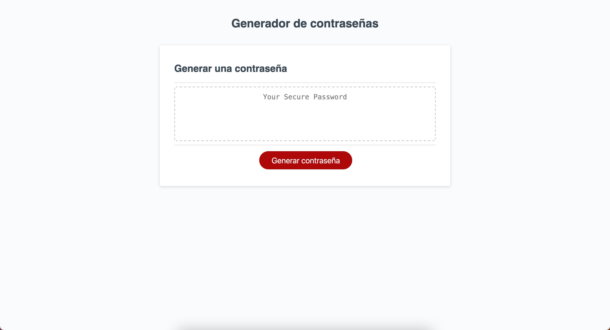
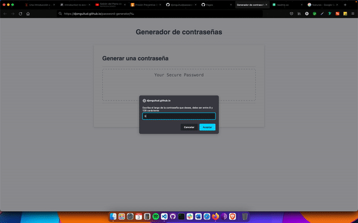

# Generador de contraseñas seguras

Esta página web genera una contraseña segura con base en criterios que el usuario elija a su conveniencia.

## Puntos clave

- Se pregunta al usuario el largo de la contraseña.
- Se pregunta al usuario si le gustaría que la contraseña contenga letras minúsculas, mayúsculas, números y/o carácteres especiales.
- Se genera la contraseña bajo esos criterios y el largo seleccionado

## Authors

- [@xandromus](https://github.com/Xandromus)
- [@djonguitud](https://github.com/djonguitud)

## Visita el generador de contraseñas

-[Haz click aqui! Para ver nuestra página web](https://djonguitud.github.io/password-generator/)

## Live demo

